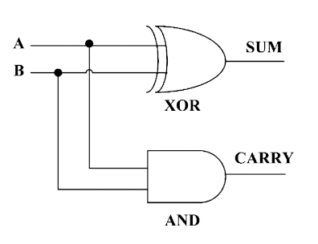

<div align='center'>


</div>

<br>

<p align="center">
    <a href="https://github.com/sponsors/melchisedech333"></a>
    <br><br>
    
    
    
    
    
    
</p>

Language: <a href="readme-pt.md">PT-BR</a>

First, it's important to make it clear that I made this code for fun. I really want to develop things using transistors, so I made this code. And it also just gave me a great desire to create a code that did binary sum using logic gates, but also that these logic gates were built with transistors (as close as possible to the operation of real transistors).

In the code I create the 2 known types of MOSFET transistors (N and P). It is important to make it clear that transistors only work with two voltage levels, represented by 0 and 1, where 0 means no voltage applied (and no electrical current passing through the Drain and Source channels), and 1 means that there is an X value of voltage or electrical current applied to the respective channels.

It is worth remembering that the basic operation of a MOSFET transistor is defined by the voltage (Volts) that is applied to the Gate, causing the electric current to flow in the Drain and Source channels.

<br>

<b>N-TYPE:</b>

In an N-type transistor, electrical current flows from the Drain towards the Source. The table below explains how the transistor works as the Gate changes.

```
       ------------->
GATE | DRAIN | SOURCE 
---------------------
0    | 0     | 0
1    | 0     | 0
0    | 1     | 0
1    | 1     | 1
```

Regarding the Gate, when it has the value 0 (zero), it means that there is no voltage applied to it. Following the same logic, when there is a value of 1, it means that there is enough voltage applied to the Gate, making it work as an electronic switch, that is, allowing the electric current to flow from the Drain to the Source.

Regarding Drain and Source, when the value is as 0 (zero), it means that there is no voltage and no electrical current. And when there is a value of 1, it means that there is voltage and/or electrical current applied to them.

<br>

<b>P-TYPE:</b>

In a P-type transistor, electrical current flows from the Source towards the Drain.

```
       ------------->
GATE | SOURCE | DRAIN
---------------------
0    | 0      | 0
1    | 0      | 0
0    | 1      | 1
1    | 1      | 0
```

<br>

Using the transistors with the above logic, communication channels are created between them, so that the logic gates are created. That is, to carry out the communication I created the equivalent of the wires that connect the transistor channels, as shown in the code below in the creation of the <b>NOT</b> logic gate (to see the complete code, access <b>[gate -construction.c](gate-construction.c)</b>).

```c
// Creates two transistors, one P-type, one N-type.
// First on the list is the P-type transistor.
gate->transistors = get_transistors(1, 1);

// Adds wires to communicate between transistor channels.
add_wire(GATE_PIN_VDD, 0, first_p(), PIN_TRANSISTOR_SOURCE);
add_wire(GATE_PIN_INPUT1, 0, first_p(), PIN_TRANSISTOR_GATE);
add_wire(first_p(), PIN_TRANSISTOR_DRAIN, GATE_PIN_OUTPUT, 0);
add_wire(GATE_PIN_INPUT1, 0, first_n(), PIN_TRANSISTOR_GATE);
add_wire(first_n(), PIN_TRANSISTOR_DRAIN, GATE_PIN_OUTPUT, 0);
add_wire(first_n(), PIN_TRANSISTOR_SOURCE, GATE_PIN_GROUND, 0);
```

Note that the <b>Vdd</b> (which represents the positive) is the origin of the first wire connected, and the <b>Ground</b> is the last.

The code above performs the following logical scheme:

<table width="100%">
  <tr>
    <td valign="top" width="50%" >
       <b>Disabled</b>
       
    </td>
    <td valign="top" width="50%" >
       <b>Enabled</b>
       
    </td>
  </tr>
</table>

<b>Note:</b> the N-type transistor placed from the CMOS output (P and N) is just to demonstrate the operation of the logic gate, causing it to drive a transistor that controls an LED. As you can see, the LED turns on and off according to the on/off state of the logic port.

Using the notions exposed above, the following ports were built:

<table width="100%">
  <tr>
    <td valign="top" width="33%" >
       <b>NOT</b>
       
    </td>
    <td valign="top" width="33%" >
       <b>NAND</b>
       
    </td>
    <td valign="top" width="33%" >
       <b>AND (NAND + NOT)</b>
       
    </td>
  </tr>
</table>

<table width="100%">
  <tr>
    <td valign="top" width="50%" >
       <b>XOR (utilizando portas NAND)</b>
       
    </td>
    <td valign="top" width="50%" >
       <b>OR (utilizando portas NAND)</b>
       
    </td>
  </tr>
</table>

<br>

The code responsible for processing the logic gates and transistors is [gate-machine.c](gate-machine.c).

<br>



Using all these things it was possible to build a <b>Half Adder</b> mechanism, similar to the one shown in the image to the side. With the difference that not only the <b>XOR</b> and <b>AND</b> gates were used, but also the <b>OR</b> and <b>NOT</b> gates.

<br>

For more details you can analyze the algorithm in the file [device-arithmetic.c](device-arithmetic.c), where the <b>Half Adder</b> mechanism was created, but also a kind of inverse, in order to work the sum algorithm implemented in the <b>process_sum()</b> function.

<br>

Here is the output of the program as it runs:

```
Operation: SUM (+)

         BINARY     | DEC
         ----------------
                    |
         0000000101 | 5
         0000000011 | 3
         ----------------
         0000001000 | 8

```

Finally, summarizing everything, the MOSFET transistors of type P and N were simulated, and with them logic gates were implemented, such as AND, NOT, NAND and others. With the logic gates, the Half Adder mechanism was implemented, and with it a binary sum algorithm was developed (to simulate a calculating machine).

<br>

**If my code has helped you, please consider [sponsoring me](https://github.com/sponsors/melchisedech333) :blue_heart:** 

<br>

:smiley: Author
---

Sponsor: [melchisedech333](https://github.com/sponsors/melchisedech333)<br>
YouTube: [Melchisedech](https://www.youtube.com/channel/UC4Sh4wxncr5arnydpUfWPKw)<br>
Twitter: [Melchisedech333](https://twitter.com/Melchisedech333)<br>
Blog: [melchisedech333.github.io](https://melchisedech333.github.io/)<br>
LinkedIn: [Melchisedech Rex](https://www.linkedin.com/in/melchisedech-rex-724152235/)


<br>

:scroll: License
---

[ BSD-3-Clause license](./license)

<br><br>

<div align="center">

## Remember to give me <br> a beautiful little star :star_struck:

</div>


