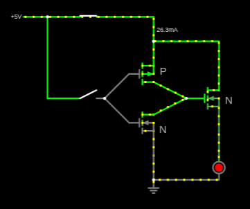
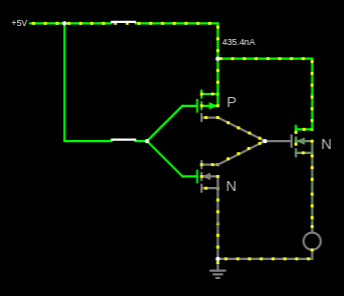
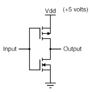
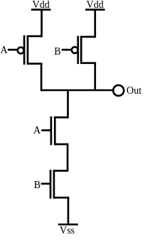
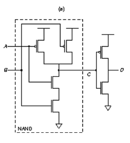
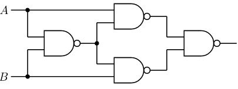
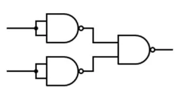

<div align='center'>


</div>

<br>

<p align="center">
    <a href="https://github.com/sponsors/melchisedech333"></a>
    <br><br>
    
    
    
    
    
    
</p>

Language: <a href="readme.md">EN-US</a>

Primeiramente é importante deixar claro que fiz este código para me divertir. Eu tenho muita vontade de desenvolver coisas utilizando transistores, por isso fiz este código. E também simplesmente me deu uma vontade muito grande de criar um código que fizesse soma binária utilizando portas lógicas, mas também que essas portas lógicas fossem construídas com transistores (o mais próximo possível do funcionamento de transistores reais).

No código eu crio os 2 tipos conhecidos de transistores MOSFET (N e P). Importante deixar claro que os transistores trabalham apenas com dois níveis de tensão, representados por 0 e 1, onde 0 significa nenhuma tensão aplicada (e nenhuma corrente elétrica passando pelos canais de Drain e Source), e 1 significa que há um valor X de tensão ou corrente elétrica aplicada nos respectivos canais.

Vale lembrar que o funcionamento básico de um transistor MOSFET é definido pela tensão (Volts) que se aplica no Gate, fazendo com que a corrente elétrica flua nos canais de Drain e Source.

<br>

<b>N-TYPE:</b>

Em um transistor do tipo N, a corrente elétrica flui do Drain em direção ao Source. A tabela abaixo explica o funcionamento do transistor conforme ocorra alteração no Gate.

```
       ------------->
GATE | DRAIN | SOURCE 
---------------------
0    | 0     | 0
1    | 0     | 0
0    | 1     | 0
1    | 1     | 1
```

Em relação ao Gate, quando o mesmo possui o valor 0 (zero), significa que não há tensão aplicada nele. Seguindo a mesma lógica, quando há o valor 1, significa que há tensão suficiente aplicada no Gate, fazendo com que ele venha a funcionar como uma chave eletrônica, ou seja, permitindo que flua corrente elétrica do Drain ao Source.

Em relação ao Drain e Source, quando o valor está como 0 (zero), significa que não há tensão e nem corrente elétrica. E quando há o valor 1, significa que há tensão e/ou corrente elétrica aplicada neles.

<br>

<b>P-TYPE:</b>

Em um transistor do tipo P, a corrente elétrica flui do Source em direção ao Drain.

```
       ------------->
GATE | SOURCE | DRAIN
---------------------
0    | 0      | 0
1    | 0      | 0
0    | 1      | 1
1    | 1      | 0
```

<br>

Utilizando os transistores com a lógica acima, é criado canais de comunicação entre eles, para que assim sejam criadas as portas lógicas. Ou seja, para realizar a comunicação eu criei os equivalentes aos fios que conectam os canais dos transistores, como demonstra o código abaixo na criação da porta lógica <b>NOT</b> (para ver o código completo acesse <b>[gate-construction.c](gate-construction.c)</b>).

```c
// Cria dois transistores, um do tipo P, outro do tipo N.
// O primeiro da lista é o transistor do tipo P.
gate->transistors = get_transistors(1, 1);

// Adiciona os fios para realizar a comunicação
// entre os canais dos transistores.
add_wire(GATE_PIN_VDD, 0, first_p(), PIN_TRANSISTOR_SOURCE);
add_wire(GATE_PIN_INPUT1, 0, first_p(), PIN_TRANSISTOR_GATE);
add_wire(first_p(), PIN_TRANSISTOR_DRAIN, GATE_PIN_OUTPUT, 0);
add_wire(GATE_PIN_INPUT1, 0, first_n(), PIN_TRANSISTOR_GATE);
add_wire(first_n(), PIN_TRANSISTOR_DRAIN, GATE_PIN_OUTPUT, 0);
add_wire(first_n(), PIN_TRANSISTOR_SOURCE, GATE_PIN_GROUND, 0);
```

Observe que o <b>Vdd</b> (que representa o positivo) é a origem do primeiro fio conectado, e o <b>Ground</b> é o último.

O código acima realiza o seguinte esquema lógico:

<table width="100%">
  <tr>
    <td width="50%" >
       Chave desligada
    </td>
    <td width="50%" >
       Chave ligada
    </td>
  </tr>
  <tr>
    <td width="50%" >
       
    </td>
    <td width="50%" >
       
    </td>
   </tr>
  </tr>
</table>

<b>Obs:</b> o transistor do tipo N colocado da saída do CMOS (P e N) é apenas para demonstrar o funcionamento da porta lógica, fazendo com que ela acione um transistor que controla um LED. Como se pode notar, o LED liga e desliga conforme o estado de ligado/desligado da porta lógica.

Utilizando as noções expostas acima, foi construído as seguintes portas:

<table width="100%">
  <tr>
    <td valign="top" width="33%" >
       <b>NOT</b>
       
    </td>
    <td valign="top" width="33%" >
       <b>NAND</b>
       
    </td>
    <td valign="top" width="33%" >
       <b>AND (NAND + NOT)</b>
       
    </td>
  </tr>
</table>
<table width="100%">
  <tr>
    <td valign="top" width="50%" >
       <b>XOR (utilizando portas NAND)</b>
       
    </td>
    <td valign="top" width="50%" >
       <b>OR (utilizando portas NAND)</b>
       
    </td>
  </tr>
</table>

<br>

:smiley: Autor
---

Patrocinar: [melchisedech333](https://github.com/sponsors/melchisedech333)<br>
YouTube: [Melchisedech](https://www.youtube.com/channel/UC4Sh4wxncr5arnydpUfWPKw)<br>
Twitter: [Melchisedech333](https://twitter.com/Melchisedech333)<br>
Blog: [melchisedech333.github.io](https://melchisedech333.github.io/)<br>
LinkedIn: [Melchisedech Rex](https://www.linkedin.com/in/melchisedech-rex-724152235/)


<br>

:scroll: Licença
---

[ BSD-3-Clause license](./license)

<br><br>

<div align="center">

## Lembre-se de deixar <br> uma linda estrelinha :star_struck:

</div>


